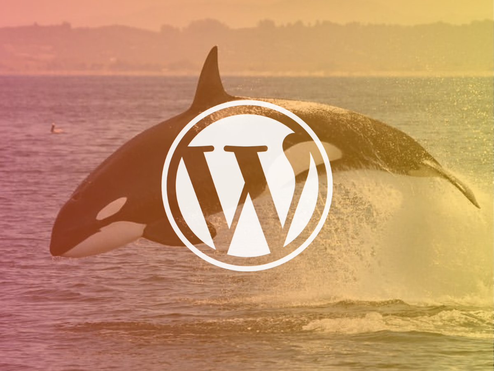

# 🐬 Cetacean University Block Theme 🖌



A Wordpress Block theme created for the [**Cetacean University site**](../../README.md) during my learning on the course **Become a WordPress Developer - Unlocking Power With Code**, by **Brad Schiff**. 

## 👩‍💻 Technologies

This theme was mainly developed using **Typescript** and React. All base templates are in **HTML** in the **templates** folder, but their HTML was created using the **Full Site Editor**.

Despite the majority of the code being in **Typescript**, most **block types** have a **render.php** on the [**source folder**](./src) that is used to render the content of the block on the final page. This is because Wordpress can either have a **static block** (Renders a **React Component** and saves the resulting HTML on the database), or a **dynamic block** (**PHP renders the block**, and only the block markup is stored in the database), and most of the blocks of our site needed to be dynamic.

Only one block uses **React** on both **editor** and **viewer** screens, which is the [**Upcoming Events and Posts**](./src/blocks/upcoming-events/) block. It only uses **PHP** to connect the data to the React **Component** on the initialization of the page. This was only done as a challenge for myself.

| Front-end | Back-end |
|--|--|
| Wordpress| Wordpress|
| PHP| PHP|
| Typescript||
| ReactJS||
| Sass||

# ✅ How to Use 

To use the theme, drag this folder on the **wp-content/theme** folder of the Wordpress site you want to use it. 

You can clone this repository, and then copy and paste the folder on the theme folder of the site you want to have it.

```bash
git clone https://github.com/vbuchara/cetacean-university.git
```

After so, clone the **.env.example** file, renaming it to just **.env**, and then change the **GOOGLE_MAPS_API_KEY** variable to the value of your **Google Maps API** key. More on how **Google Maps API keys** works on https://developers.google.com/maps/documentation/javascript/get-api-key.

```
GOOGLE_MAPS_API_KEY="KEY"
```

Finally, open the folder on a terminal of your choice, and run **yarn** and **yarn build**. More on how to install **Yarn** on https://classic.yarnpkg.com/lang/en/docs/install/.

- **NOTE**: It's also necessary to setup a **constant** on the **wp-config** file of your site, in order to make the Google Maps work on the pages it is used.

```php
define('GOOGLE_MAPS_API_KEY', "YOUR_KEY");
```

- **IMPORTANT**: For the **custom post types** used on the pages to work you will need to also get the **must use plugin** on the file [**university_post_types.php**](../../mu-plugins/university_post_types.php) and place it on the same folder on your **wp-content** directory.

## ⭐ Features

- It includes all [**the general features listed here**](../../README.md), plus the fact of being a **Block theme**, all pages are customizable in the **Editor** page in the **Appearances** menu.

    - It's possible to add other blocks to the pages, belonging to this theme or not, and remove some of existing pages. 
  
- The [**Pet Adoption**](../../plugins/pet-adoption/README.md) plugin does not work properly with this theme, since it relies on a **traditional Wordpress template** to display information such as **header** and **footer**.   